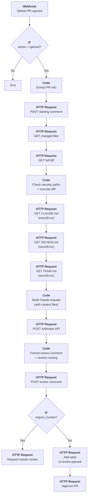
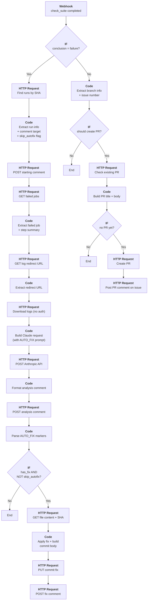
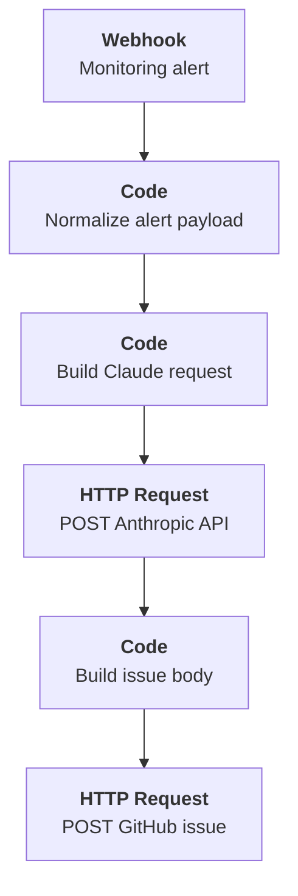
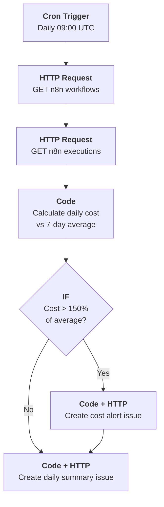

# n8n Setup for DevLLMOps

n8n orchestrates the automated feedback loops between GitHub, AI agents, observability, and your team. This guide covers deployment and the five core workflows.

## 1. Deploy n8n

Self-host or use the hosted version of n8n.

For production, run behind a reverse proxy (nginx/Caddy) with HTTPS. n8n receives webhooks from GitHub containing repository metadata -- TLS is required.

## 2. Configure Credentials

The deploy script can auto-create credential entries on n8n (see section 5). You then fill in the secret values via the n8n UI. Here are the credentials you'll need:

| Credential                 | Type                                | How to Get                                                                                                   |
| -------------------------- | ----------------------------------- | ------------------------------------------------------------------------------------------------------------ |
| **GitHub API**             | GitHub OAuth App or PAT             | GitHub > Settings > Developer Settings > PATs. Scopes: `repo`, `project`, `workflow`, `actions:read`         |
| **Anthropic API**          | Header Auth (name: `x-api-key`)     | [console.anthropic.com](https://console.anthropic.com/) > API Keys                                           |
| **Anthropic API (native)** | Anthropic API (`anthropicApi`)      | Same API key as above. Required by WF01's AI Agent node (n8n-langchain nodes use the native credential type) |
| **n8n Internal API**       | Header Auth (name: `X-N8N-API-KEY`) | n8n > Settings > API > Create API Key. Used by workflow 05 to self-track execution costs                     |
| **Slack** *(optional)*     | Slack OAuth                         | Slack app with `chat:write` scope for notifications                                                          |

## 3. GitHub Webhooks

Each n8n workflow has its own webhook endpoint. WF01 uses an **org-level webhook** for board events; the others use **repo-level webhooks**.

| Webhook                    | Scope         | Payload URL                                                 | Events             |
| -------------------------- | ------------- | ----------------------------------------------------------- | ------------------ |
| Board Events (WF01)        | **Org-level** | `https://n8n.yourdomain.com/webhook/devllmops-github-board` | `projects_v2_item` |
| PR AI Review (WF02)        | Repo-level    | `https://n8n.yourdomain.com/webhook/devllmops-github-pr`    | `pull_request`     |
| CI Failure Auto-Fix (WF03) | Repo-level    | `https://n8n.yourdomain.com/webhook/devllmops-github-ci`    | `check_suite`      |

For all webhooks, set:

- **Content type:** `application/json`
- **SSL verification:** enabled

### Creating webhooks via CLI

```bash
# Org-level webhook for workflow 01 - Board-Driven Intent Analysis
# Requires admin:org_hook scope: gh auth refresh -h github.com -s admin:org_hook
gh api /orgs/YOUR_ORG/hooks --method POST --input - <<'EOF'
{
  "name": "web",
  "active": true,
  "events": ["projects_v2_item"],
  "config": {
    "url": "https://n8n.yourdomain.com/webhook/devllmops-github-board",
    "content_type": "json",
    "insecure_ssl": "0"
  }
}
EOF

# Repo-level webhook for workflow 02 - PR AI Review
gh api repos/OWNER/REPO/hooks --method POST --input - <<'EOF'
{
  "name": "web",
  "active": true,
  "events": ["pull_request"],
  "config": {
    "url": "https://n8n.yourdomain.com/webhook/devllmops-github-pr",
    "content_type": "json"
  }
}
EOF

# Repo-level webhook for workflow 03 - CI Failure Auto-Fix
gh api repos/OWNER/REPO/hooks --method POST --input - <<'EOF'
{
  "name": "web",
  "active": true,
  "events": ["check_suite"],
  "config": {
    "url": "https://n8n.yourdomain.com/webhook/devllmops-github-ci",
    "content_type": "json"
  }
}
EOF
```

Workflow 04 (Production Alert) uses a separate webhook at `/webhook/devllmops-production-alert` — point your monitoring tool (Prometheus, Grafana, Datadog, UptimeKuma) to it directly. Workflow 05 (Daily Cost Report) runs on a cron schedule and does not need a webhook.

## 4. Core Workflows

All AI-generated comments follow a consistent format: a robot header (`> 🤖 This is an automated message from the DevLLMOps AI Agent`), a bold one-sentence summary, and full details in a collapsed `<details>` section. All HTTP nodes include retry (3x) and timeouts (30s GitHub, 120s Claude).

### Workflow 1: Board-Driven Intent Analysis + Auto-Develop

When an issue is moved to **AI Ready** on the GitHub Projects board, the workflow creates a typed feature branch, posts a "starting" comment, moves the item to **In Progress**, then asks Claude for an implementation plan. If the issue has the **auto-develop** checkbox checked, a **single-shot pipeline** fetches source files from the branch, sends them all to Claude in one prompt, parses `FILE` blocks from the response, and commits each changed file. CI then runs automatically, and on success WF03 creates a PR.

The pipeline uses two sub-workflows:

- **Helper sub-workflow** (`01-commit-helper.json`) — handles read/commit operations via the GitHub Contents API (base64 encoding, SHA tracking)
- **Anthropic Proxy** (`01-anthropic-proxy.json`) — optional proxy for routing Anthropic API calls (used to work around n8n LangChain `$schema` bug; see `FUTURE_IMPROVEMENTS.md`)

The trigger is an org-level `projects_v2_item` webhook (not a repo-level `issues` webhook). The workflow validates that the status field was changed to "AI Ready" before proceeding -- all other column transitions are silently ignored.

Branch names are derived from issue labels:

| Label                   | Prefix | Example                      |
| ----------------------- | ------ | ---------------------------- |
| bug                     | `b/`   | `b/#12-fix-login-crash`      |
| feature                 | `f/`   | `f/#5-add-dark-mode`         |
| refactoring             | `r/`   | `r/#7-extract-utils`         |
| operations              | `o/`   | `o/#9-upgrade-nginx`         |
| docs & research         | `d/`   | `d/#11-api-docs`             |
| enhancement *(default)* | `e/`   | `e/#3-replace-question-list` |

```mermaid
flowchart TD
    A["`**Webhook**
    projects_v2_item event`"] --> B{"`**IF**
    action = edited
    AND Status field
    AND Issue
    AND correct project?`"}
    B -- No --> Z[End]
    B -- Yes --> C["`**HTTP Request**
    GraphQL: fetch item
    status + issue details`"]
    C --> D{"`**Code**
    Status = AI Ready?
    (returns [] if not)`"}
    D -- No --> Z
    D -- Yes --> E["`**Code**
    Prepare context
    (branch name from labels)`"]
    E --> F["`**HTTP Request**
    POST starting comment`"]
    F --> G["`**HTTP Request**
    GraphQL: move to
    In Progress`"]
    G --> H["`**HTTP Request**
    GET main HEAD SHA`"]
    H --> I["`**HTTP Request**
    Create feature branch`"]
    I --> J["`**Code**
    Build Claude request`"]
    J --> K["`**HTTP Request**
    POST Anthropic API`"]
    K --> L["`**Code**
    Format analysis comment`"]
    L --> M["`**HTTP Request**
    POST analysis comment`"]
    M --> N{"`**IF**
    auto-develop
    checked?`"}
    N -- No --> Z2[End]
    N -- Yes --> O["`**HTTP Request**
    GET CLAUDE.md`"]
    O --> P["`**HTTP Request**
    GET file tree`"]
    P --> Q["`**Code**
    Select Files
    (from analysis + tree)`"]
    Q --> R["`**SplitInBatches**
    Fetch Loop`"]
    R -->|loop| R1["`**HTTP Request**
    Fetch File
    (GitHub Contents API)`"]
    R1 --> R
    R -->|done| S["`**Code**
    Build Full Prompt
    (files + SHA map)`"]
    S --> T["`**HTTP Request**
    Claude Implementation
    (Sonnet, extended thinking)`"]
    T --> U["`**Code**
    Parse & Prepare Commits
    (FILE blocks + diff filter)`"]
    U --> V["`**SplitInBatches**
    Commit Loop`"]
    V -->|loop| V1["`**HTTP Request**
    Commit via Helper`"]
    V1 --> V
    V -->|done| W["`**Code**
    Format Output`"]
    W --> Y["`**Code**
    Build summary comment`"]
    Y --> ZZ["`**HTTP Request**
    POST implementation comment`"]
```



| Step                        | n8n Node          | Details                                                                                                                                                                                                                                                                                                            |
| --------------------------- | ----------------- | ------------------------------------------------------------------------------------------------------------------------------------------------------------------------------------------------------------------------------------------------------------------------------------------------------------------ |
| **Trigger**                 | Webhook           | Org-level `projects_v2_item` event on path `/webhook/devllmops-github-board`                                                                                                                                                                                                                                       |
| **Filter**                  | IF                | `action == "edited"` AND `field_node_id == STATUS_FIELD_ID` AND `content_type == "Issue"` AND `project_node_id` matches                                                                                                                                                                                            |
| **Fetch item**              | HTTP Request      | GraphQL query: `node(id: item_id)` fetches Status name, issue number/title/body/labels/repo                                                                                                                                                                                                                        |
| **Validate AI Ready**       | Code              | Returns `[]` (stops execution) if status !== "AI Ready". Extracts issue data + `project_item_node_id`                                                                                                                                                                                                              |
| **Prepare context**         | Code              | Maps issue labels to branch prefix (`b/f/r/o/d/e`), computes `{prefix}/#N-slug`                                                                                                                                                                                                                                    |
| **Starting comment**        | HTTP Request      | Posts acknowledgment with branch name in collapsible details                                                                                                                                                                                                                                                       |
| **Move to In Progress**     | HTTP Request      | GraphQL mutation: `updateProjectV2ItemFieldValue` sets status to In Progress. Loop-safe: the resulting `projects_v2_item.edited` event is ignored because Validate AI Ready returns `[]` for non-AI-Ready statuses                                                                                                 |
| **Create branch**           | HTTP Request      | `GET .../git/ref/heads/main` then `POST .../git/refs` to create the typed branch                                                                                                                                                                                                                                   |
| **AI analysis**             | Code + HTTP       | Builds request body safely in JS (avoids JSON interpolation issues), calls `claude-haiku-4-5-20251001`                                                                                                                                                                                                             |
| **Post analysis**           | Code + HTTP       | Parses `SUMMARY:` line from Claude response, posts with AI header + collapsed details                                                                                                                                                                                                                              |
| **Check auto-develop**      | IF                | Checks if issue body contains `[x] Yes, auto-develop` checkbox                                                                                                                                                                                                                                                     |
| **Fetch context**           | HTTP Request x2   | Fetches CLAUDE.md (neverError) and recursive file tree from branch                                                                                                                                                                                                                                                 |
| **Select Files**            | Code              | Extracts backtick-quoted paths from the analysis text, cross-references with the file tree. Falls back to selecting all source files by extension if no exact matches. Always includes CLAUDE.md. Capped at 15 files                                                                                               |
| **Fetch Loop**              | SplitInBatches v3 | Iterates over selected files (batch=1). Output [0]=done, [1]=loop                                                                                                                                                                                                                                                  |
| **Fetch File**              | HTTP Request      | `GET /repos/{repo}/contents/{path}?ref={branch}` with `neverError: true`                                                                                                                                                                                                                                           |
| **Build Full Prompt**       | Code              | Decodes fetched files from base64, builds system + user prompt with FILE block output format. Stores `_shaMap` (path→SHA) and `_contentMap` (path→original content) for downstream use. Warns Claude that analysis paths may not exist. Uses `claude-sonnet-4-20250514` with extended thinking (10K budget tokens) |
| **Claude Implementation**   | HTTP Request      | POST to Anthropic Messages API. Sonnet, 16K output tokens, 5-minute timeout, extended thinking enabled. Returns FILE blocks with complete file contents                                                                                                                                                            |
| **Parse & Prepare Commits** | Code              | Extracts `FILE:` blocks and `SUMMARY:` from Claude response. Compares each file against `_contentMap` to **filter out unchanged files** (prevents empty commits). Looks up SHAs from `_shaMap` for existing file updates                                                                                           |
| **Commit Loop**             | SplitInBatches v3 | Iterates over parsed files (batch=1). Output [0]=done, [1]=loop                                                                                                                                                                                                                                                    |
| **Commit via Helper**       | HTTP Request      | POST to helper sub-workflow webhook with path, content, SHA, branch, commit message (`[auto-develop] Update {path}`)                                                                                                                                                                                               |
| **Format Output**           | Code              | Reads `_meta` from Parse & Prepare Commits, builds `{output, intermediateSteps}` for the summary                                                                                                                                                                                                                   |
| **Summary comment**         | Code + HTTP       | Posts summary comment listing committed files on the issue                                                                                                                                                                                                                                                         |

### Workflow 2: PR Opened > AI Review + Routing

When a PR is opened, the workflow posts a "starting review" comment, fetches the diff, checks for security-critical paths, fetches the repo's `CLAUDE.md` and `REVIEW.md` for project-specific context and review guidelines, asks Claude for a code review, then either auto-approves or requests human review.

The review prompt is driven by two optional repo files:

- **CLAUDE.md** -- project context, conventions, security-critical paths (provides the reviewer with project knowledge)
- **REVIEW.md** -- review-specific guidelines: what to check, severity levels, project-specific rules (controls what the reviewer looks for)

If `REVIEW.md` is absent, the reviewer falls back to a default checklist (bugs, OWASP Top 10, error handling, performance). A template is available at [`templates/REVIEW.md`](../templates/REVIEW.md).



| Step                        | n8n Node     | Details                                                                                                                                                                                                                                        |
| --------------------------- | ------------ | ---------------------------------------------------------------------------------------------------------------------------------------------------------------------------------------------------------------------------------------------- |
| **Trigger**                 | Webhook      | GitHub PR event on path `/webhook/devllmops-github-pr`                                                                                                                                                                                         |
| **Filter**                  | IF           | `action == "opened"`                                                                                                                                                                                                                           |
| **Starting comment**        | HTTP Request | Posts acknowledgment with PR number and branch                                                                                                                                                                                                 |
| **Get diff**                | HTTP Request | `GET /pulls/{number}` with `Accept: application/vnd.github.v3.diff`, truncated to 50K chars                                                                                                                                                    |
| **Truncate diff**           | Code         | Truncates diff to 50K chars and passes through PR context                                                                                                                                                                                      |
| **Fetch CLAUDE.md**         | HTTP Request | `GET /repos/{repo}/contents/CLAUDE.md?ref={head_branch}` with `neverError: true`. Provides project context and security-critical paths                                                                                                         |
| **Fetch REVIEW.md**         | HTTP Request | `GET /repos/{repo}/contents/REVIEW.md?ref={head_branch}` with `neverError: true`. Provides review guidelines; falls back to defaults if absent                                                                                                 |
| **Fetch TEAM.md**           | HTTP Request | `GET /repos/{repo}/contents/TEAM.md?ref={head_branch}` with `neverError: true`. Provides reviewer routing table                                                                                                                                |
| **AI review**               | Code + HTTP  | Decodes all three files from base64, builds prompt with project context + review guidelines + team context, calls `claude-haiku-4-5-20251001`                                                                                                  |
| **Build comment + routing** | Code         | Parses Claude response, then dynamically determines `require_human` by matching changed files against CLAUDE.md security-critical paths and resolves reviewers from TEAM.md routing table                                                      |
| **Add label**               | HTTP Request | Adds `ai-review-passed` label to signal AI review passed (false branch only)                                                                                                                                                                   |
| **Route**                   | IF           | If `require_human`: request review from team members resolved via TEAM.md. Otherwise: add label + auto-approve via `POST /pulls/{number}/reviews` (approve may fail with 422 if the same account opened the PR; the label provides the signal) |

### Workflow 3: CI Check Suite > Auto-Fix + Auto-PR

Handles both CI failures and successes on feature branches. **On failure:** finds the failed run by commit SHA, posts a "investigating" comment, downloads logs (handling GitHub's redirect-based log endpoint), asks Claude for a diagnosis, and **automatically commits a fix** if Claude provides a single-file replacement. An `[auto-fix]` commit message prefix prevents infinite fix-fail-fix loops. **On success:** automatically creates a pull request (if none exists) so the AI Review workflow (WF02) is triggered.



#### Failure path (auto-fix)

| Step                 | n8n Node        | Details                                                                                                                                                                                              |
| -------------------- | --------------- | ---------------------------------------------------------------------------------------------------------------------------------------------------------------------------------------------------- |
| **Trigger**          | Webhook         | GitHub `check_suite` event on path `/webhook/devllmops-github-ci`                                                                                                                                    |
| **Filter**           | IF              | `conclusion == "failure"`                                                                                                                                                                            |
| **Find runs**        | HTTP Request    | `GET /actions/runs?head_sha={sha}&status=failure` (note: `check_suite.id` is **not** a run ID)                                                                                                       |
| **Comment target**   | Code            | Extracts PR number from `check_suite.pull_requests`, or issue number from branch name (`{prefix}/#N-...`). Sets `skip_autofix = true` if head commit starts with `[auto-fix]`                        |
| **Get logs**         | HTTP Request x2 | First request gets the 302 redirect URL (with `followRedirects: false`, `neverError: true`), second request downloads the logs **without auth** (GitHub's signed URL rejects forwarded auth headers) |
| **AI diagnosis**     | Code + HTTP     | `claude-sonnet-4-6` analyzes logs and step summary, returns root cause + exact diff fix + optional `AUTO_FIX` block                                                                                  |
| **Post analysis**    | Code + HTTP     | Parses `SUMMARY:` line, posts with AI header, collapsed details, and link to the failed run                                                                                                          |
| **Parse auto-fix**   | Code            | Extracts `AUTO_FIX_FILE`, `AUTO_FIX_OLD`, `AUTO_FIX_NEW` markers from Claude response                                                                                                                |
| **Has fix?**         | IF              | Proceeds only if `has_fix == true` AND `skip_autofix == false` (prevents infinite loops)                                                                                                             |
| **Get file**         | HTTP Request    | `GET /repos/{owner}/{repo}/contents/{path}?ref={branch}` — fetches base64 content + SHA                                                                                                              |
| **Apply fix**        | Code            | Base64-decodes file, applies string replacement, re-encodes, builds PUT body with `[auto-fix]` commit message                                                                                        |
| **Commit fix**       | HTTP Request    | `PUT /repos/{owner}/{repo}/contents/{path}` with new content, SHA, and branch                                                                                                                        |
| **Post fix comment** | HTTP Request    | Posts comment confirming the auto-fix commit with file and branch details                                                                                                                            |

#### Success path (auto-PR)

| Step                    | n8n Node     | Details                                                                                                                                                                         |
| ----------------------- | ------------ | ------------------------------------------------------------------------------------------------------------------------------------------------------------------------------- |
| **Extract branch info** | Code         | Validates `conclusion == "success"`, skips protected branches (`main`, `master`, `release`, `develop`), extracts repo/owner/branch/issue_number using branch regex from wf03-04 |
| **Should create PR?**   | IF           | Proceeds only if `should_create_pr == true`                                                                                                                                     |
| **Check existing PR**   | HTTP Request | `GET /repos/{repo}/pulls?head={owner}:{branch}&state=open` — prevents duplicate PRs                                                                                             |
| **Build PR body**       | Code         | Humanizes branch slug into title (e.g. `f/#5-add-dark-mode` -> `Feature: Add Dark Mode (#5)`), builds body with AI header + `Closes #N`                                         |
| **No PR yet?**          | IF           | Proceeds only if `has_existing_pr == false`                                                                                                                                     |
| **Create PR**           | HTTP Request | `POST /repos/{repo}/pulls` with title, body, head=branch, base=main. Triggers WF02 via `pull_request.opened` webhook                                                            |
| **Post PR comment**     | HTTP Request | Posts comment on linked issue confirming PR creation (`neverError: true` for branches without issue numbers)                                                                    |

### Workflow 4: Production Alert > Agent Investigation

When your monitoring fires an alert, Claude investigates and creates a GitHub issue with the analysis.



| Step                 | n8n Node    | Details                                                                                                                                                            |
| -------------------- | ----------- | ------------------------------------------------------------------------------------------------------------------------------------------------------------------ |
| **Trigger**          | Webhook     | Incoming alert on path `/webhook/devllmops-production-alert` from Prometheus, Grafana, Datadog, or UptimeKuma                                                      |
| **Normalize**        | Code        | Extracts `alert_name`, `severity`, `description`, `service` from various monitoring payload formats                                                                |
| **AI investigation** | Code + HTTP | `claude-sonnet-4-6` provides root cause, impact assessment, mitigation steps, follow-up actions                                                                    |
| **Create issue**     | Code + HTTP | Title: `[ALERT] {alert_name}`, labels: `incident` + `intent`, body with AI header + collapsed details. The `intent` label triggers Workflow 1 for further analysis |

### Workflow 5: Daily Cost Report

Scheduled workflow that self-tracks AI token spend from n8n's own execution history and alerts on cost overruns. No external usage API required -- costs are estimated from execution counts per workflow and known model pricing.



| Step                 | n8n Node     | Details                                                                                                                                                                           |
| -------------------- | ------------ | --------------------------------------------------------------------------------------------------------------------------------------------------------------------------------- |
| **Trigger**          | Cron         | Daily at 09:00 UTC                                                                                                                                                                |
| **Fetch workflows**  | HTTP Request | `GET /api/v1/workflows` via n8n Internal API credential -- maps workflow IDs to names and AI models                                                                               |
| **Fetch executions** | HTTP Request | `GET /api/v1/executions?limit=250&status=success` -- last 250 successful executions                                                                                               |
| **Calculate**        | Code         | Filters to last 24h, estimates tokens per execution based on model (Haiku for WF 01/02, Sonnet for WF 03/04), stores daily costs in `staticData` for a real 7-day rolling average |
| **Threshold check**  | IF           | `daily_cost > 1.5 * rolling_average` (requires at least 2 days of history)                                                                                                        |
| **Alert / Summary**  | Code + HTTP  | Creates a GitHub issue with AI header, one-line cost summary, and collapsible breakdown by workflow. Labels: `cost-alert` or `daily-report`                                       |

## 5. Deploy Workflows

Workflow source code lives in two directories:

| Directory            | Contents                                                       |
| -------------------- | -------------------------------------------------------------- |
| `n8n/workflows/`     | Template JSONs (node layout, connections, settings)             |
| `n8n/scripts/`       | Extracted jsCode (one `.js` file per Code node, by node ID)    |

A Python deploy script (`n8n/deploy.py`) injects scripts into templates, maps credentials, and deploys via the n8n REST API. Missing credentials and workflows are auto-created on first run.

### First-time setup

```bash
# 1. Copy the credentials template
cp n8n/credentials.env.example n8n/credentials.env

# 2. Fill in your n8n host and API key file path
#    N8N_HOST=https://n8n.yourdomain.com
#    N8N_API_KEY_FILE=~/.n8n_key

# 3. Run setup — creates credentials + workflows on n8n, saves IDs
make setup

# 4. Configure credential secrets in the n8n UI
#    (the script creates empty credentials; fill in tokens/keys via the UI)
```

The setup is idempotent: running it again skips already-configured resources.

### Deploying workflows

```bash
# Deploy all workflows (includes setup check)
make deploy-all

# Deploy a specific workflow
make deploy-02-pr-ai-review

# Build without deploying (outputs JSON to stdout)
make build-02-pr-ai-review

# List workflows and their n8n IDs
make list-workflows
```

### Editing workflow code

1. Edit the `.js` file in `n8n/scripts/` (e.g., `wf02-08.js` for WF02's "Build Claude Body" node)
2. Run `make deploy-02-pr-ai-review` to inject and deploy
3. The workflow is automatically activated

### Remaining placeholders

After deploying, you may still need to update these placeholders in the n8n UI:

| Placeholder                            | Replace with                                                    |
| -------------------------------------- | --------------------------------------------------------------- |
| `REPLACE_ME_HELPER_WF_ID`              | The workflow ID of `01-commit-helper` (shown by `make list-workflows`) |
| `OWNER/REPO`                           | Your GitHub `org/repo` (e.g., `MyOrg/my-app`)                   |
| `REPLACE_WITH_QUALITY_SENTINEL_HANDLE` | Your Quality Sentinel's GitHub username (workflow 02)           |

## 6. Connecting Workflows to the Projects Board

### GitHub Projects Board

| Column           | Meaning                                              |
| ---------------- | ---------------------------------------------------- |
| **Backlog**      | New items, discussion and refining                   |
| **Ready**        | Refined and prioritized issues ready to be worked on |
| **AI Ready**     | Context complete, triggers AI agent (WF01)           |
| **In Progress**  | Human or Agent working and Context Engineer steering |
| **Verification** | CI + AI review running                               |
| **Human Review** | Flagged for human attention (security, architecture) |
| **Done**         | Merged and complete                                  |

New issues are auto-added to **Backlog**. Moving an issue to **AI Ready** triggers WF01 (Intent Analysis + Auto-Develop). The agent automatically moves the item to **In Progress** once it starts working. Deployment to production is the Product Architect's responsibility and is not tracked as a separate board column. See [GitHub Setup](github-setup.md).

To move issues/PRs across the board programmatically, use the GitHub GraphQL API in HTTP Request nodes.

### Reading an item's current status

```graphql
query($id: ID!) {
  node(id: $id) {
    ... on ProjectV2Item {
      id
      fieldValueByName(name: "Status") {
        ... on ProjectV2ItemFieldSingleSelectValue {
          name
          optionId
        }
      }
      content {
        ... on Issue {
          number
          title
          body
          labels(first: 10) { nodes { name } }
          repository { nameWithOwner }
        }
      }
    }
  }
}
```

### Transitioning an item to a new status

```graphql
mutation($projectId: ID!, $itemId: ID!, $fieldId: ID!, $optionId: String!) {
  updateProjectV2ItemFieldValue(input: {
    projectId: $projectId
    itemId: $itemId
    fieldId: $fieldId
    value: { singleSelectOptionId: $optionId }
  }) { projectV2Item { id } }
}
```

Get the IDs once via `gh project field-list` and hardcode them in n8n or store as environment variables. WF01 uses both queries above: it reads the item status to validate "AI Ready", then transitions it to "In Progress" after the agent starts working.

## 7. Security Notes

- **HTTPS required** -- n8n receives webhooks with repo data; always use TLS
- **Verify webhook signatures** -- set the GitHub webhook secret in n8n trigger nodes
- **Credential isolation** -- store API keys in n8n's credential store, never in workflow JSON
- **Rate limit Claude calls** -- add a Function node with a token counter before API calls to prevent runaway costs
- **Restrict n8n access** -- use n8n's built-in auth or put it behind a VPN; only GitHub webhooks should reach it from outside
