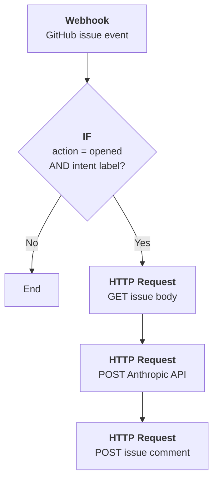
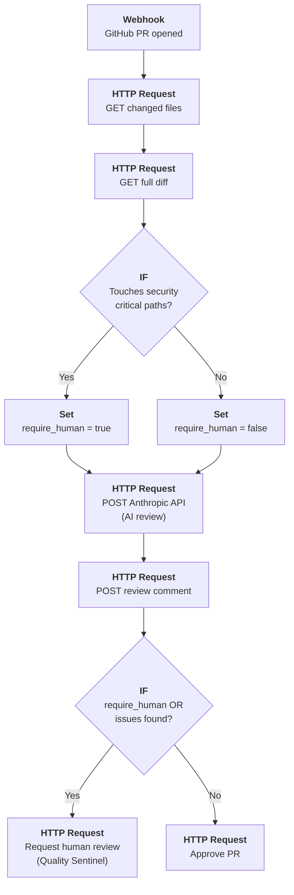
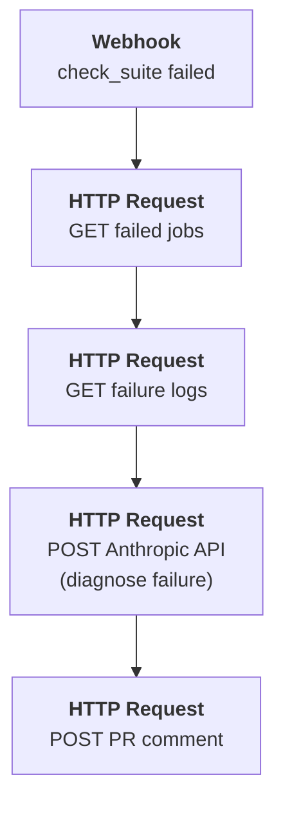
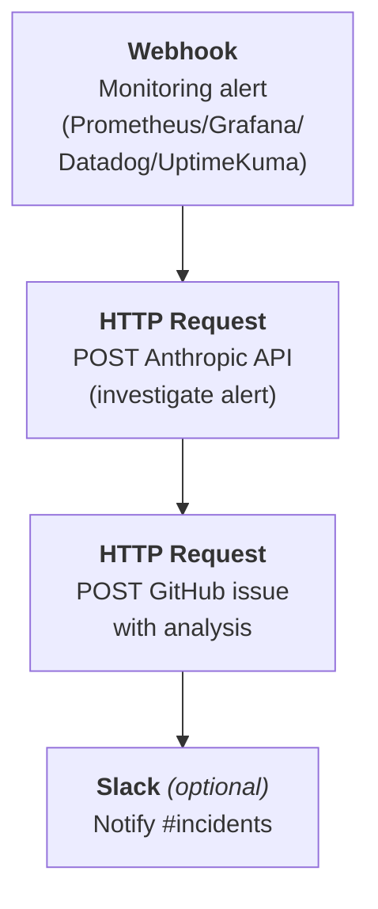
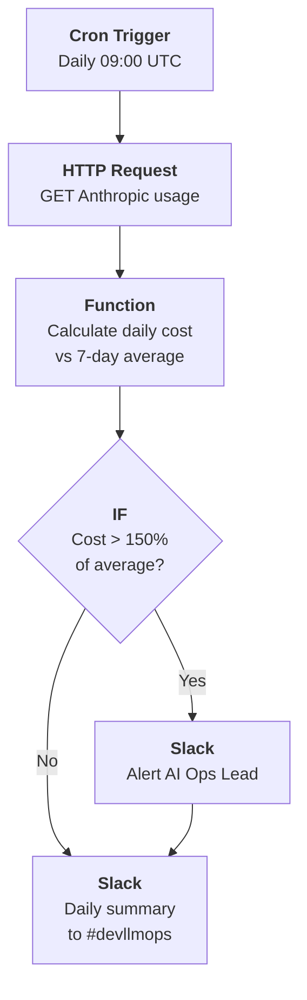

# n8n Setup for DevLLMOps

n8n orchestrates the automated feedback loops between GitHub, AI agents, observability, and your team. This guide covers deployment and the five core workflows.

## 1. Deploy n8n

```bash
docker run -d --name n8n \
  -p 5678:5678 \
  -v n8n_data:/home/node/.n8n \
  -e WEBHOOK_URL=https://n8n.yourdomain.com \
  n8nio/n8n
```

For production, run behind a reverse proxy (nginx/Caddy) with HTTPS. n8n receives webhooks from GitHub containing repository metadata -- TLS is required.

Open `http://localhost:5678` and create an admin account.

## 2. Configure Credentials

In n8n **Settings > Credentials**, create:

| Credential | Type | How to Get |
| --- | --- | --- |
| **GitHub API** | GitHub OAuth App or PAT | GitHub > Settings > Developer Settings > PATs. Scopes: `repo`, `project`, `workflow` |
| **Anthropic API** | Header Auth (name: `x-api-key`) | [console.anthropic.com](https://console.anthropic.com/) > API Keys |
| **Slack** *(optional)* | Slack OAuth | Slack app with `chat:write` scope for notifications |

## 3. GitHub Webhook

In your repo **Settings > Webhooks**:

- **Payload URL:** `https://n8n.yourdomain.com/webhook/github`
- **Content type:** `application/json`
- **Secret:** generate with `openssl rand -hex 32`, save it for n8n
- **Events:** Issues, Pull requests, Check suites, Push

In every n8n GitHub webhook trigger node, set the same secret for signature verification.

## 4. Core Workflows

### Workflow 1: New Intent > Agent Analysis

When a GitHub issue is created with the `intent` label, Claude analyzes it and posts an implementation plan as a comment.



| Step | n8n Node | Details |
| --- | --- | --- |
| **Trigger** | Webhook | GitHub issue event, filtered to `opened` action |
| **Filter** | IF | `event.action == "opened"` AND `"intent" in labels` |
| **Fetch issue** | HTTP Request | `GET /repos/{owner}/{repo}/issues/{number}` with GitHub credential |
| **AI analysis** | HTTP Request | `POST api.anthropic.com/v1/messages` -- model: `claude-haiku-4-5-20251001`, prompt asks for implementation approach, affected files, risks |
| **Post comment** | HTTP Request | `POST /repos/{owner}/{repo}/issues/{number}/comments` -- body: `## Agent Analysis\n\n{{ response }}` |

### Workflow 2: PR Opened > AI Review + Routing

When a PR is opened, Claude reviews the diff and either approves or flags for human review.



| Step | n8n Node | Details |
| --- | --- | --- |
| **Trigger** | Webhook | GitHub PR event, filtered to `opened` targeting `main` |
| **Get files** | HTTP Request | `GET /repos/{owner}/{repo}/pulls/{number}/files` |
| **Get diff** | HTTP Request | `GET /repos/{owner}/{repo}/pulls/{number}.diff` (Accept: `application/vnd.github.v3.diff`), truncate to 50K chars |
| **Security check** | IF | Check filenames against: `auth/`, `payments/`, `deploy*`, `workflows/` |
| **Set flag** | Set | `require_human = true/false` |
| **AI review** | HTTP Request | `POST api.anthropic.com/v1/messages` -- model: `claude-haiku-4-5-20251001`, reviews for bugs, OWASP Top 10, missing error handling |
| **Post comment** | HTTP Request | `POST /repos/{owner}/{repo}/issues/{number}/comments` -- body: `## AI Review\n\n{{ response }}` |
| **Route** | IF | If `require_human` or issues found: request review from Quality Sentinel (GitHub handle from `TEAM.md`). Otherwise: approve PR via `POST /pulls/{number}/reviews` with `"event": "APPROVE"` |

### Workflow 3: CI Failure > Agent Auto-Fix

When CI checks fail on a PR, Claude reads the logs and suggests a fix.



| Step | n8n Node | Details |
| --- | --- | --- |
| **Trigger** | Webhook | GitHub `check_suite` event, `conclusion = "failure"` |
| **Get jobs** | HTTP Request | `GET /repos/{owner}/{repo}/actions/runs/{run_id}/jobs` |
| **Get logs** | HTTP Request | `GET /repos/{owner}/{repo}/actions/jobs/{job_id}/logs`, truncate to 30K chars |
| **AI diagnosis** | HTTP Request | `POST api.anthropic.com/v1/messages` -- model: `claude-sonnet-4-6`, prompt asks for specific file + line fix |
| **Post comment** | HTTP Request | `POST /repos/{owner}/{repo}/issues/{pr_number}/comments` -- body: `## CI Failure Analysis\n\n{{ response }}` |

### Workflow 4: Production Alert > Agent Investigation

When your monitoring fires an alert, Claude investigates and creates an issue.



| Step | n8n Node | Details |
| --- | --- | --- |
| **Trigger** | Webhook | Incoming alert from Prometheus, Grafana, Datadog, or UptimeKuma |
| **AI investigation** | HTTP Request | `POST api.anthropic.com/v1/messages` -- model: `claude-sonnet-4-6`, prompt includes alert name, severity, details, service |
| **Create issue** | HTTP Request | `POST /repos/{owner}/{repo}/issues` -- title: `[ALERT] {{ alert_name }}`, labels: `incident`, `intent`, body includes agent analysis and tags Quality Sentinel |
| **Notify** | Slack *(optional)* | Post to `#incidents` channel |

### Workflow 5: Daily Cost Report

Scheduled workflow that tracks AI token spend and alerts on overruns.



| Step | n8n Node | Details |
| --- | --- | --- |
| **Trigger** | Cron | Daily at 09:00 UTC |
| **Fetch usage** | HTTP Request | `GET api.anthropic.com/v1/organizations/{org_id}/usage` (check Anthropic docs for exact endpoint) |
| **Calculate** | Function | `input_tokens * price + output_tokens * price`, compare to 7-day rolling average |
| **Threshold check** | IF | `daily_cost > 1.5 * rolling_average` |
| **Alert** | Slack | If over threshold: alert AI Ops Lead / Product Architect with spend amount |
| **Summary** | Slack | Post to `#devllmops`: `AI usage yesterday: $X | 7-day avg: $Y | Month-to-date: $Z` |

## 5. Connecting Workflows to the Projects Board

To move issues/PRs across the GitHub Projects board (Intent > In Progress > Verification > etc.), use the GitHub GraphQL API in HTTP Request nodes:

```text
POST https://api.github.com/graphql

Body:
{
  "query": "mutation {
    updateProjectV2ItemFieldValue(input: {
      projectId: \"PROJECT_ID\"
      itemId: \"ITEM_ID\"
      fieldId: \"STATUS_FIELD_ID\"
      value: { singleSelectOptionId: \"OPTION_ID\" }
    }) { projectV2Item { id } }
  }"
}
```

Get the IDs once via `gh project field-list` and hardcode them in n8n or store as environment variables.

## 6. Security Notes

- **HTTPS required** -- n8n receives webhooks with repo data; always use TLS
- **Verify webhook signatures** -- set the GitHub webhook secret in n8n trigger nodes
- **Credential isolation** -- store API keys in n8n's credential store, never in workflow JSON
- **Rate limit Claude calls** -- add a Function node with a token counter before API calls to prevent runaway costs
- **Restrict n8n access** -- use n8n's built-in auth or put it behind a VPN; only GitHub webhooks should reach it from outside
